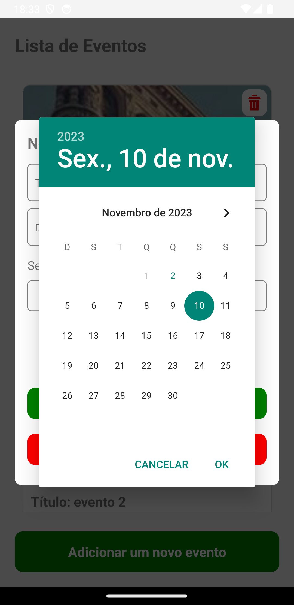
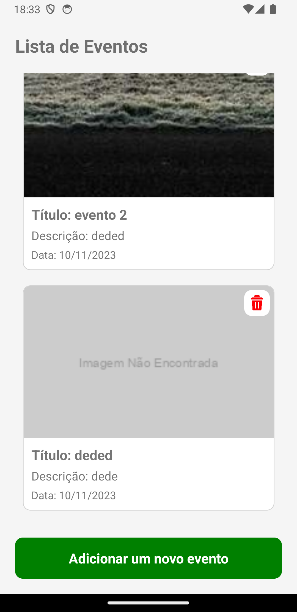

# EventHub

## Purpose

- A proposta do EventHub é para que as pessoas possam utilizar o aplicativo como uma lista de eventos. O aplicativo é capaz de armazenar os dados dos usários por meio de um banco de dados, e retornar os eventos mais próximos de sua lista. O usuário poderá adicionar eventes, título, descrição, datas e até mesmo decidir adicionar uma foto. Todos os dados serão visualizados por meio de uma listagem que estará presente no menu principal do aplicativo, podendo ser da escolha do usuário se o evento continuará ou será removido.

## Tecnologias Utilizadas

- MongoDB
- Express.js
- React Native
- TypeScript
- date-fns (para formatação de datas)
- react-native-datepicker (para exibir um calendário)
- Métodos HTTP (GET, POST, PUT, DELETE)
- useState (para gerenciamento de estado)
- Interface e Typescript
- Stylesheet (para estilização)

## EventHub App Preview

### Screenshot:

  
  <br>
  <br>
  
  <br>
  <br>
  
  <br>
  <br>
  
  <br>
  <br>
  
  <br>
  <br>
  
  <br>
  <br>
  
  <br>
  <br>
  
  <br>

## How to Use

### Clone the repository to your local machine:

```bash
git clone git@github.com:FranciscoVieir/EventHub.git
```

### Access the folder

```bash
cd eventMobileApp
```

## Install dependencies:

```bash
npm install
```

#### or

```bash
yarn start
```

### Para rodar o Backend

1. Navegue para o diretório do backend:

```bash
cd backend
```

### rode comando:

```bash
npm run build
```

#### e inície o servidor com:

```bash
npm run start
```

### Para rodar o Frontend

1. Navegue para o diretório do backend:

```bash
cd frontend
```

### inície a aplicação frontend com:

```bash
npm run android
```

## Availble Scripts

In the project, directory, you can run the following scripts:

- npm run start or yarn start: Starts the CLI development server.
- npm run android or yarn android: Runs the app on an Android emulator/simulator.
- npm run ios or yarn ios: Runs the app on an iOS simulator.
- npm run eject or yarn eject: Ejects the app from CLI, if needed.
